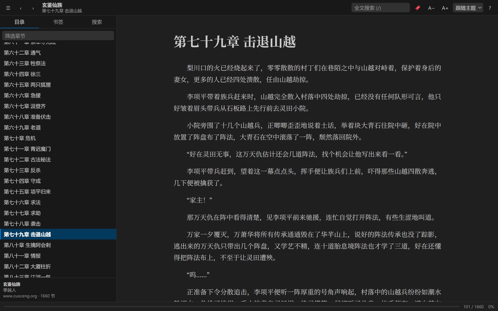
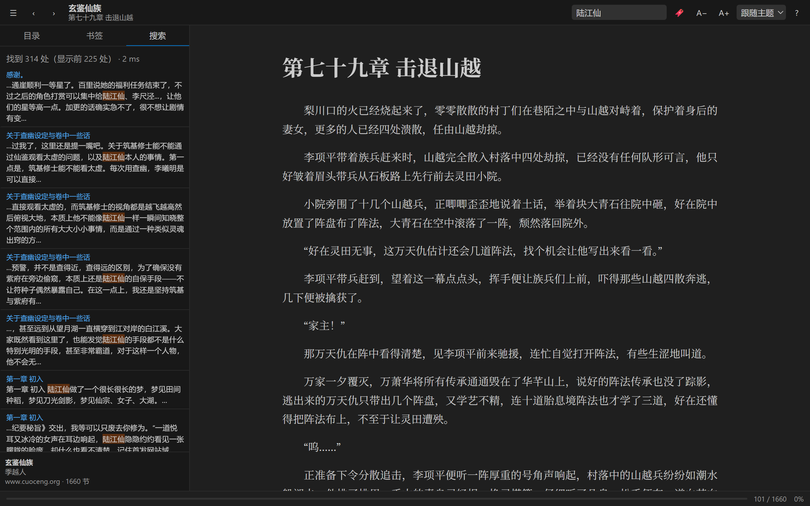

# EPUB Reader

在 VS Code 里直接读 EPUB 电子书 —— 双击 `.epub` 就能打开，不用切到别的阅读器。零运行时依赖，只用 Node 标准库解析 ZIP 与 XHTML。

[](https://marketplace.visualstudio.com/items?itemName=ssfg.epub-reader)
[](https://marketplace.visualstudio.com/items?itemName=ssfg.epub-reader)
[](https://github.com/juzishazhou/epub_reader_vscode/actions/workflows/ci.yml)
[](LICENSE)



## 功能

| 能力 | 说明 |
| --- | --- |
| 双击即读 | 注册 `.epub` 自定义编辑器，资源管理器右键也能「用 EPUB Reader 打开」 |
| 目录导航 | EPUB 3 的 NAV 与 EPUB 2 的 NCX 都支持，多级目录树 + 筛选框，自动定位当前章 |
| 全书搜索 | 跨全部章节搜索，带上下文片段、命中数与耗时，点击跳转并高亮命中处 |
| 书签 | 在当前位置加书签（自动摘录当前段落），列表可跳转、删除 |
| 进度记忆 | 记住每本书的章节与滚动位置，重开自动回到原位；「继续阅读…」列出最近读的书 |
| 完整排版 | EPUB 内的 CSS、`@import`、`url()`、图片、SVG、字体全部解析改写；正文在 Shadow DOM 中渲染，书的样式不会污染 VS Code 界面 |
| 安全清洗 | 章节里的 `<script>`、`<iframe>`、`on*` 事件属性、`javascript:` 链接一律剔除，配合 CSP 双重拦截 |
| 阅读设置 | 字号、行高、行宽、正文配色（跟随主题 / 浅色 / 护眼 / 深色），实时生效并持久化 |
| 跟随主题 | 工具栏、目录、状态栏全部使用 VS Code 主题变量，亮色 / 暗色 / 高对比度都正常 |



## 安装

**Marketplace**：在 VS Code 扩展面板搜索 `EPUB Reader`，或

```powershell
code --install-extension ssfg.epub-reader
```

**手动安装 VSIX**：从 [Releases](https://github.com/juzishazhou/epub_reader_vscode/releases) 下载 `.vsix` 后

```powershell
code --install-extension epub-reader-0.1.0.vsix
```

## 打开一本书

1. 在资源管理器里**双击**任意 `.epub`；
2. 或者右键 →「打开方式...」→「EPUB Reader」；
3. 或者命令面板执行 `EPUB Reader: 用 EPUB Reader 打开`。

> **和别的 epub 扩展共存**：如果装了多个能打开 `.epub` 的扩展，双击时可能被对方接管。用右键「打开方式...」显式选择，或在用户设置里钉死：
> ```json
> "workbench.editorAssociations": { "*.epub": "epubReader.reader" }
> ```

## 快捷键

| 按键 | 作用 |
| --- | --- |
| `[` / `←` / `h` | 上一章 |
| `]` / `→` / `l` | 下一章 |
| `t` | 展开 / 收起侧栏 |
| `/` | 聚焦搜索框 |
| `b` | 在当前位置加书签 |
| `+` / `-` | 字号增减 |
| `0` | 恢复默认字号 |
| `?` | 显示快捷键帮助 |
| `Esc` | 关闭浮层 / 取消输入焦点 |

在输入框里打字时单键快捷键不会触发，中文输入法组合期间也不会误触发搜索。

## 设置

| 配置项 | 默认 | 说明 |
| --- | --- | --- |
| `epubReader.fontSize` | `17` | 正文字号（px），12–40 |
| `epubReader.lineHeight` | `1.75` | 行高倍数，1.2–3 |
| `epubReader.maxWidth` | `46` | 正文最大宽度（rem），限制行长便于阅读 |
| `epubReader.pageTheme` | `auto` | `auto` 跟随 VS Code 主题，或 `light` / `sepia` / `dark` |
| `epubReader.rememberProgress` | `true` | 是否记住阅读位置 |

## 常见问题

**中文乱码？**
不会。读取章节时会嗅探 BOM 与 XML 声明里的编码，GBK / GB18030 / Big5 / UTF-16 都能正确解码。

**打开报「无法打开」？**
加密或带 DRM 的 EPUB（Adobe ADEPT、LCP）不支持，会给出明确提示。文件损坏、缺 `META-INF/container.xml` 同理。

**目录里某一项点了没反应？**
目录项指向的不是 spine 里的正文（有些书会指向单独的版权页或封面页），此时会提示并跳过。

**进度和书签存在哪？**
存在 VS Code 的 `globalState` 里（`epubReader.progress` / `epubReader.bookmarks` / `epubReader.recents`），以**文件路径**哈希为键，所以重新下载同名书不会丢进度。解压出的图片样式缓存在扩展 `globalStorage/books/` 下，两周未访问会自动清理。想完全重置：命令面板执行 `EPUB Reader: 清除阅读记录与书签`，再删掉 `globalStorage/books` 目录。

**排版为什么和手机阅读器不完全一样？**
正文渲染在 Shadow DOM 里，书的 CSS 中 `html` / `body` / `:root` 选择器不会命中，这部分样式由阅读器接管——这正是它能稳定跟随 VS Code 主题、且书的样式不会污染编辑器界面的原因。其余选择器（类名、标签、图片、表格等）都按书的原样生效。

**支持多大的书？**
实测 9.9 MB / 1660 章的 EPUB：打开约 76 ms，全书建索引约 260 ms。索引按需建立，首次搜索会显示进度提示。

## 开发

架构说明、代码结构、测试与调试方式见 [DEVELOPMENT.md](DEVELOPMENT.md)；发版流程见 [RELEASING.md](RELEASING.md)。

```powershell
npm install
npm run compile     # tsc 编译到 out/
npm run verify      # 编译 + webview 契约检查 + 42 项测试
npm run screenshot  # 用真实渲染生成 docs/*.png
```

## 许可

[MIT](LICENSE)
